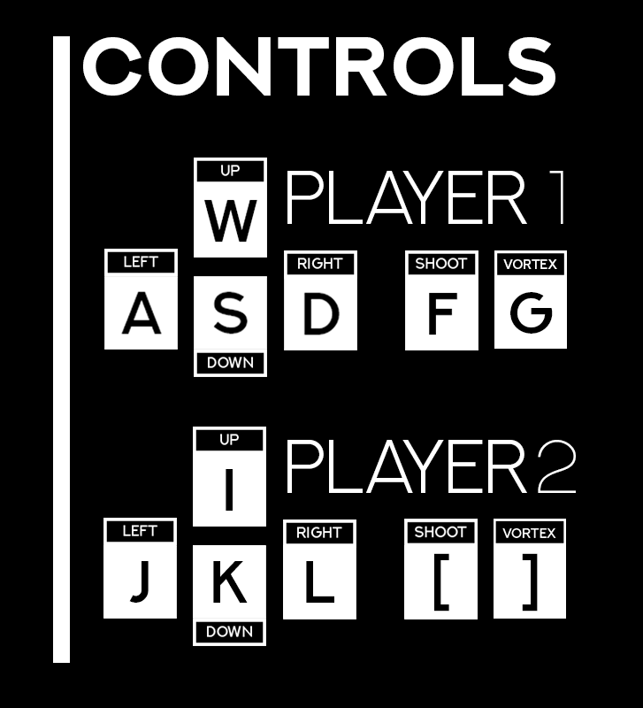

# Vortex
__A multiplayer 2D portal-based shooter game is written in Java with its own custom game engine called Singularity.__

This game engine is written **from scratch** in Java with OOP princples in mind and supports display buffering, collision detection, and spritemap parsing. It also allows users to create levels and update the game assets by creating their own sprites and adding them to the game folder.

Custom levels can also be create by creating bitmap files where each pixel of a certain color is mapped to certain game floor tiles and the sprite parser will automatically create levels from the level files present!

